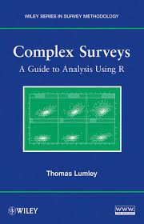
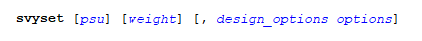

class: hide_logo
```{r setup, echo=FALSE}
knitr::read_chunk('assets/init.R')
```

```{r, echo=FALSE, cache=FALSE, message=FALSE,  warning = FALSE}
<<init>>
```

## Outline `r top_icon("list")`
<br/>
- ### Survey data? 
- ### Complex sampling designs 
- ### Non-independence and unequal sampling probability: why should we care?
- ### (Proper) analysis of survey data: approaches 
<br/>
Examples: , </img>&nbsp;
  
???

shift-c : open a cloned window
shift-p : toggle to presenter mode


---
class: hide_logo
## Survey data?  

<br/><br/><br/><br/>
#.center[ Data that are collected by means of any method other than .content-box-yellow[simple random sampling] from a .content-box-yellow[large population]]

???
Key words: 
1. **Simple random sampling**: equal probability of selection of all member of the target population; 
2. **Large (Infinite) population**: large population compared to sample size (pop/sample > 10000) so sampling with replacement = sampling without replacement 

---
class: hide_logo

## Sampling strategies 

.center[
```{r survey_1a, echo=FALSE}
qtm(PROV, fill = "prov_code") + tm_layout(legend.show = FALSE, frame = FALSE) 
```
]

???
Simple random sampling
 
---
class: hide_logo

## Sampling strategies 

.center[
```{r survey_1b, echo=FALSE}
set.seed(1234)

qtm(PROV, fill = "prov_code") + tm_layout(legend.show = FALSE, frame = FALSE) + # BREAK
qtm(spsample(as_Spatial(PROV), 100, type = "random"), symbols.size = 0.5, symbols.col = "red")

```
]

---
class: hide_logo

## Sampling strategies 

.center[
```{r survey_2a, echo=FALSE}
qtm(DIST, fill = "dist_code") + tm_layout(legend.show = FALSE, frame = FALSE) + tmap_options(max.categories = 53)

```
]

???
more efficient (in a practical sense, not statistical)
We consider the 53 distrcits in SA
and we select some of them, say 18

---
class: hide_logo

## Sampling strategies 

.center[
```{r survey_2b, echo=FALSE}
set.seed(1234)

SELECTED_DIST <- unique(DIST$dist_code)[sample(nrow(DIST),18)]
CDIST <- subset(DIST, dist_code %in% SELECTED_DIST)
DIST$SELECTED <- DIST$dist_code %in% SELECTED_DIST
POINTS <- spsample(as_Spatial(CDIST), 100, type = "random")

qtm(DIST, fill = "SELECTED") + tm_layout(legend.show = FALSE, frame = FALSE) + tmap_options(max.categories = 53)

```
]

???
OK if we are interested in estimates for the whole country only.
But not if we want lower levele stimates (e.g. at provincial level)

---
class: hide_logo

## Sampling strategies 
 
.center[
```{r survey_2c, echo=FALSE}
qtm(DIST, fill = "SELECTED") + qtm(POINTS, symbols.size = 0.5, symbols.col = "red") + tm_layout(legend.show = FALSE, frame = FALSE) + tmap_options(max.categories = 53)

```
]
---
class: hide_logo
 
## Sampling strategies 
.center[
```{r survey_2d, echo=FALSE}
qtm(PROV, fill = "prov_code") + qtm(POINTS, symbols.size = 0.5, symbols.col = "red") + tm_layout(legend.show = FALSE, frame = FALSE) 
```
]

???
Stratified sampling: we repeat the process separately for each stratum (== province))
E.g. 2 district per province, and 6 individuals per district

---
class: hide_logo
 
## Sampling strategies 

.center[
```{r survey_3a, echo=FALSE}
set.seed(1234)

SELECTED_DIST <- NULL
DIST1 <- subset(DIST, !dist_code %in% c("CBDC2", "CBDC3", "CBDC4", "CBDC8"))

for (p in unique(PROV$prov_code)) {
  D <- subset(DIST1, prov_code == p)
  SDIST <- D$dist_code[sample(nrow(D),2)]
  SELECTED_DIST <- c(SELECTED_DIST,SDIST)
}

CDIST <- subset(DIST, dist_code %in% SELECTED_DIST)
DIST$SELECTED <- DIST$dist_code %in% SELECTED_DIST
POINTS <- rep(list(NA),18)

for (i in c(1:18)) {
  dis <- unique(CDIST$dist_code)[i]
  D <- subset(CDIST, dist_code == dis)
  POINTS[[i]] <- spsample(as_Spatial(D), 6, type = "random")
}

qtm(DIST, fill = "SELECTED") + qtm(PROV, fill = NULL, borders = "red")  + tm_layout(frame = FALSE) 
```
]

???
Better, but....

---
class: hide_logo
 
## Sampling strategies 

.center[
```{r survey_3b, echo=FALSE}
qtm(DIST, fill = "SELECTED") +  qtm(PROV, fill = NULL, borders = "red") + 
                                qtm(POINTS[[1]], symbols.size = 0.5, symbols.col = "red") +
                                qtm(POINTS[[2]], symbols.size = 0.5, symbols.col = "red") +
                                qtm(POINTS[[3]], symbols.size = 0.5, symbols.col = "red") +
                                qtm(POINTS[[4]], symbols.size = 0.5, symbols.col = "red") +
                                qtm(POINTS[[5]], symbols.size = 0.5, symbols.col = "red") +
                                qtm(POINTS[[6]], symbols.size = 0.5, symbols.col = "red") +
                                qtm(POINTS[[7]], symbols.size = 0.5, symbols.col = "red") +
                                qtm(POINTS[[8]], symbols.size = 0.5, symbols.col = "red") +
                                qtm(POINTS[[9]], symbols.size = 0.5, symbols.col = "red") + 
                                qtm(POINTS[[10]], symbols.size = 0.5, symbols.col = "red") +
                                qtm(POINTS[[11]], symbols.size = 0.5, symbols.col = "red") +
                                qtm(POINTS[[12]], symbols.size = 0.5, symbols.col = "red") +
                                qtm(POINTS[[13]], symbols.size = 0.5, symbols.col = "red") +
                                qtm(POINTS[[14]], symbols.size = 0.5, symbols.col = "red") +
                                qtm(POINTS[[15]], symbols.size = 0.5, symbols.col = "red") +
                                qtm(POINTS[[16]], symbols.size = 0.5, symbols.col = "red") +
                                qtm(POINTS[[17]], symbols.size = 0.5, symbols.col = "red") +
                                qtm(POINTS[[17]], symbols.size = 0.5, symbols.col = "red") + 
                                tm_layout(legend.show = FALSE, frame = FALSE) + tmap_options(max.categories = 53)
```
]

???
small provinces and large provinces have the same number of individuals....

---
class: hide_logo
 
## Sampling strategies 

.center[
```{r survey_3c, echo=FALSE}
qtm(PROV, fill = "prov_code") + 
  qtm(POINTS[[1]], symbols.size = 0.5, symbols.col = "red") +
  qtm(POINTS[[2]], symbols.size = 0.5, symbols.col = "red") +
  qtm(POINTS[[3]], symbols.size = 0.5, symbols.col = "red") +
  qtm(POINTS[[4]], symbols.size = 0.5, symbols.col = "red") +
  qtm(POINTS[[5]], symbols.size = 0.5, symbols.col = "red") +
  qtm(POINTS[[6]], symbols.size = 0.5, symbols.col = "red") +
  qtm(POINTS[[7]], symbols.size = 0.5, symbols.col = "red") +
  qtm(POINTS[[8]], symbols.size = 0.5, symbols.col = "red") +
  qtm(POINTS[[9]], symbols.size = 0.5, symbols.col = "red") + 
  qtm(POINTS[[10]], symbols.size = 0.5, symbols.col = "red") +
  qtm(POINTS[[11]], symbols.size = 0.5, symbols.col = "red") +
  qtm(POINTS[[12]], symbols.size = 0.5, symbols.col = "red") +
  qtm(POINTS[[13]], symbols.size = 0.5, symbols.col = "red") +
  qtm(POINTS[[14]], symbols.size = 0.5, symbols.col = "red") +
  qtm(POINTS[[15]], symbols.size = 0.5, symbols.col = "red") +
  qtm(POINTS[[16]], symbols.size = 0.5, symbols.col = "red") +
  qtm(POINTS[[17]], symbols.size = 0.5, symbols.col = "red") +
  qtm(POINTS[[17]], symbols.size = 0.5, symbols.col = "red") + 
  tm_layout(legend.show = FALSE, frame = FALSE)  + tmap_options(max.categories = 53)  
```
]

???
Disproportionate sampling 
Comment on self-weightinhg

---
class: hide_logo
 
## Sampling strategies 
  
.center[
```{r survey_3d, echo=FALSE}

set.seed(1234)

POINTS <- rep(list(NA),18)
SSIZE <- c(6,6,6,18,6,6,6,6,6,6,6,6,6,18,18,6,6,18)

for (i in c(1:18)) {
  dis <- unique(CDIST$dist_code)[i]
  D <- subset(CDIST, dist_code == dis)
  POINTS[[i]] <- spsample(as_Spatial(D), SSIZE[i], type = "random")
}

qtm(PROV, fill = "prov_code") + 
  qtm(POINTS[[1]], symbols.size = 0.5, symbols.col = "red") +
  qtm(POINTS[[2]], symbols.size = 0.5, symbols.col = "red") +
  qtm(POINTS[[3]], symbols.size = 0.5, symbols.col = "red") +
  qtm(POINTS[[4]], symbols.size = 0.5, symbols.col = "red") +
  qtm(POINTS[[5]], symbols.size = 0.5, symbols.col = "red") +
  qtm(POINTS[[6]], symbols.size = 0.5, symbols.col = "red") +
  qtm(POINTS[[7]], symbols.size = 0.5, symbols.col = "red") +
  qtm(POINTS[[8]], symbols.size = 0.5, symbols.col = "red") +
  qtm(POINTS[[9]], symbols.size = 0.5, symbols.col = "red") + 
  qtm(POINTS[[10]], symbols.size = 0.5, symbols.col = "red") +
  qtm(POINTS[[11]], symbols.size = 0.5, symbols.col = "red") +
  qtm(POINTS[[12]], symbols.size = 0.5, symbols.col = "red") +
  qtm(POINTS[[13]], symbols.size = 0.5, symbols.col = "red") +
  qtm(POINTS[[14]], symbols.size = 0.5, symbols.col = "red") +
  qtm(POINTS[[15]], symbols.size = 0.5, symbols.col = "red") +
  qtm(POINTS[[16]], symbols.size = 0.5, symbols.col = "red") +
  qtm(POINTS[[17]], symbols.size = 0.5, symbols.col = "red") +
  qtm(POINTS[[17]], symbols.size = 0.5, symbols.col = "red") + 
  tm_layout(legend.show = FALSE, frame = FALSE) + tmap_options(max.categories = 53)  
```
]

---
class: hide_logo
background-image: url("images/enumeration.png")
background-position: 50% 50%
background-size: 50%

## In reality... 

???
Statistics South Africa enumeration areas (Free State)

---
class: hide_logo, middle, center


.pull-left[
# .content-box-yellow[Unequal sampling] 

]

.pull-right[
# .content-box-red[Clustering]  
]

.pull-left[
# .content-box-yellow[Stratification]  
]

.pull-right[
# .content-box-green[Finite population] 
]

???
Characteristics that differentiate complex sampling strategies used in surveys from simple random sampling.

---
class: hide_logo, center, middle 
# .content-box-red[Why should we care?] 

---
class: hide_logo, middle

.pull-left[
.center[
# .content-box-yellow[BIASED ESTIMATES] 
]
]
.pull-right[
.center[
# .content-box-green[INCORRECT QUANTIFICATION OF SAMPLING ERROR]
]
]
 
???
Ignoring the sampling strategy in the (i.e. assuming that it was simple random sampling) introduces bias in the estimates and incorrect quantification of sampling error

---
class: hide_logo, middle, center

# .content-box-yellow[Unequal sampling, stratification] 

---
class: hide_logo
# An example Dataset

```{r survey_4a, echo=TRUE}
summary(DATA[, c(1:3,5,7)])
```


???
South African population 40-74 years
Estimated 10 years cardiovascular risk
Example dataset, modified for teaching purposes...

---
class: hide_logo

```{r survey_4b, echo=TRUE}
mean(DATA$globorisk_nonlab) 
aggregate(DATA$globorisk_nonlab, by = list(DATA$geo1), FUN = mean)
```


???
Estimating average cardiovascular risk

---
class: hide_logo

```{r survey_4c, echo=TRUE}

cbind(data.frame(table(DATA$geo1)), POP2016)

```
 
---
class: hide_logo
.small[
```{r survey_4d, echo=TRUE}

psamp <- table(DATA$geo1)/POP2016$pop  
psamp
sweight <- 1/psamp 
sweight
sweight <- sweight/sum(sweight)
sweight 

```
 ]
---
class: hide_logo

```{r survey_4e, echo=TRUE}

aest <- aggregate(DATA$globorisk_nonlab, by = list(DATA$geo1), FUN = mean)$x # BREAK
west <- aest %*% sweight 
west

mean(DATA$globorisk_nonlab) 

```
 
???
bias!

---
class: hide_logo, center, middle 
# .content-box-red[What about regression models?] 
---
class: hide_logo

```{r survey_5a, echo=TRUE}
glm(globorisk_nonlab ~ age, family = gaussian(link = "identity"), data = DATA)
```
  
???
Similar effects happens when the estimates of interest are not simple descriptive statistics but, for example, regression coefficients: 

  
---
class: hide_logo
  
```{r survey_5b, echo=TRUE}
WEIGHTS <- data.frame(sweight)
colnames(WEIGHTS) <- c("geo1","sweight")
DATA <- merge(DATA, WEIGHTS)

glm(globorisk_nonlab ~ age, family = gaussian(link = "identity"), 
    weights = DATA$sweight, data = DATA)
```


---
class: hide_logo, middle, center

$$y = (y_1, y_2, y_3, \cdots y_n) \;\;\;\;\;\;\;\;\;\;\;\;\;\;\;\;\;\; L(y,\theta) = f(y_1,\theta)f(y_2,\theta)\cdots f(y_n,\theta) = \prod_{i=1}^{n}f(y_i,\theta)$$

$$\underset{\theta}{\operatorname{argmax}} \prod_{i=1}^{n}f(y_i,\theta) =  \underset{\theta}{\operatorname{argmax}} \sum_{i=1}^{n} log(f(y_i,\theta))$$

$$\underset{\theta}{\operatorname{argmax}} \sum_{i=1}^{n} \color{red}{\mathbf{w_i}}log(f(y_i,\theta))$$
???
pseudo-likelihood


---
class: hide_logo, center, middle

# .content-box-red[Clustering] 

???
What about clustering
negative effect on variance

---
class: hide_logo
background-image: url("images/sampling1.png")
background-position: 50% 50%
background-size: 80%

???
simple random sample
increasing sample size we increase the 'information' we have on teh population

---
class: hide_logo
background-image: url("images/sampling2.png")
background-position: 50% 50%
background-size: 80%

???
simple random sample
increasing sample size we don't increase the 'information' we have on the population (new element very similar to teh previous do not add any information...in this extreme case they are useless...)

---
class: hide_logo
<br/>
### .content-box-red[Clustering:]  
<br/>
Dividing the population into groups and sampling from a random subset of these groups will **decrease precision for a given sample size**  
<br/>
The reduction in precision increases as the units within each cluster become **more similar to each other**.   
<br/>
A measure of the level of "similarity" of the units in each cluster (compared to units in different clusters) is given by the **intraclass correlation coefficient**:

$$ ICC = \frac{\sigma_c^2}{\sigma_c^2 + \sigma_e^2} $$
???
proportion of total variance explained by variation between clusters ($$\sigma_c$$). $$\sigma_e^2$$ is the variance within groups. 
You know about random intercept model: it is the decomposition of the total variance across levels

$$Y_{ij} = \mu + \alpha_j + \epsilon_{ij}$$
---
class: hide_logo
<br/>

A measure of the effect of ICC on the precision of the estimates is given by the **design effect**, which is (an estimate of) the increase of the standar error of the estimates when using cluster sampling rather than simple random sampling:  
  
$$DEFF = \sqrt{\frac{\sigma_{CS}^2}{\sigma_{SRS}^2}}$$

<br/>
The **effective sample size** in survey data is (an estimate of) the sample that we would have needed in the hypothesiss of simple random sampling: 

$$ n_{eff} = \frac{n}{DEFF}$$

???

---
class: hide_logo
# An example

```{r survey_6, include=FALSE}
KZN <- droplevels(subset(DATA, geo1 == "KZN"))
X <- aggregate(KZN$globorisk_nonlab, by = list(geo2 = KZN$geo2), FUN = mean)
X$y <- c(25,20,10,5,5,10,10,30,5,5,25)
KZN <- merge(KZN, X, by = "geo2", all.x = TRUE, all.y = FALSE)
KZN$risk <- KZN$y + rtruncnorm(nrow(KZN),-15,15,0,8)

m <- KZN %>% group_by(geo2) %>%
  summarise(n = n()) %>%
  summarise(m = mean(n))

SSIZE <- nrow(KZN)

rho1 <- ICC(y = KZN$globorisk_nonlab, cl = KZN$geo2)$ICC
DEFF1 <- 1 + (as.integer(m) - 1) * rho1
NEFF1 <- round(SSIZE/DEFF1,0)

rho2 <- ICC(y = KZN$risk, cl = KZN$geo2)$ICC
DEFF2 <- 1 + (as.integer(m) - 1) * rho2
NEFF2 <- round(SSIZE/DEFF2,0)


```


.pull-left[
.center[#### .content-box-yellow[ICC = `r round(rho1,2)`, DEFF = `r round(DEFF1,2)`, NEFF = `r NEFF1`]]
```{r survey_6a, echo=FALSE, out.width = '400px'}
ggplot(KZN, aes(x = geo2, y = globorisk_nonlab)) +
geom_point() +
geom_point(aes(y = x), col = "red", shape = 3, size = 2)
```
]

.pull-right[
.center[#### .content-box-green[ICC = `r round(rho2,2)`, DEFF = `r round(DEFF2,2)`, NEFF = `r NEFF2`]]
```{r survey_6b, echo=FALSE, out.width = '400px'}
ggplot(KZN, aes(x = geo2, y = risk)) +
geom_point() +
geom_point(aes(y = y), col = "red", shape = 3, size = 2)
```
]

???

ACTUAL SAMPLE SIZE = `r SSIZE`

---
class: hide_logo, center, middle

# .content-box-red[Analysing clustered data] 

???

---
class: hide_logo
background-image: url("images/dep1.png")
background-position: 50% 40%
background-size: 80%
 
---
class: hide_logo
background-image: url("images/dep2.png")
background-position: 50% 40%
background-size: 80%

---
class: hide_logo
background-image: url("images/dep3.png")
background-position: 50% 40%
background-size: 80%

.footnote[.scriptsize[<cite>`r Citet(bib, c("Lumley2004A","Muff2016","MacKinnon2023"))`</cite>]]

---
class: hide_logo

# Conditional Models

<br/><br/><br/>
$$
\operatorname{globorisk} = \alpha + \epsilon
$$

$$
\operatorname{globorisk} = \alpha + \beta_{1}(\operatorname{age}) + \epsilon
$$

$$
\begin{aligned}
  \operatorname{globorisk}_{i}  &\sim N \left(\alpha_{j[i]}, \sigma^2 \right) \\
    \alpha_{j}  &\sim N \left(\mu_{\alpha_{j}}, \sigma^2_{\alpha_{j}} \right)
    \text{, for geo1 j = 1,} \dots \text{,J}
\end{aligned}
$$

$$
\begin{aligned}
  \operatorname{globorisk}_{i}  &\sim N \left(\alpha_{j[i]} + \beta_{1}(\operatorname{age}), \sigma^2 \right) \\
    \alpha_{j}  &\sim N \left(\mu_{\alpha_{j}}, \sigma^2_{\alpha_{j}} \right)
    \text{, for geo1 j = 1,} \dots \text{,J}
\end{aligned}
$$

---
class: hide_logo

.small[
.pull-left[
```{r survey_7a1, echo=TRUE}
nm <- lm(globorisk_nonlab ~ 1, 
            data = DATA)
summary(nm)$coefficients
```
]

.pull-right[
```{r survey_7a2, echo=TRUE}
library(lme4)
cm <- lmer(globorisk_nonlab ~ (1 | geo1), 
             data = DATA)
summary(cm)
```
]
]

---
class: hide_logo

.small[
.pull-left[
```{r survey_7b1, echo=TRUE}
nm <- lm(globorisk_nonlab ~ age + 1 , 
            data = DATA)
summary(nm)$coefficients
```
]

.pull-right[
```{r survey_7b2, echo=TRUE}
library(lme4)
cm <- lmer(
       globorisk_nonlab ~ age + (1 | geo1), 
       data = DATA)
summary(cm)
```
]
]

---
class: hide_logo

# Marginal Models
<br/><br/><br/><br/><
$$
\begin{aligned}
\mu_i = \beta_{0} + \beta_{1}(\operatorname{age_i}) \\
\sum_{i=1}^{N}{\frac{\partial \mu_i}{\partial \beta}V_i^{-1}\{Y_i-\mu_i(\beta)\}}
\end{aligned}
$$
---
class: hide_logo

.small[
.pull-left[
```{r survey_7d1, echo=TRUE}
nm <- lm(globorisk_nonlab ~ age + 1 , 
            data = DATA)
summary(nm)$coefficients
```
]

.pull-right[
```{r survey_7d2, echo=TRUE}
library(gee)
mm <- gee(globorisk_nonlab ~ age + 1 , 
          id = geo1, 
          data = DATA,  
          corstr = "exchangeable")
t(summary(mm)$coefficients)
```
]
] 

---
class: hide_logo
background-image: url("images/sandwich.png")
background-position: 50% 60%
background-size: 40%

# 'Robust' estimators

--

<br/><br/><br/><br/><br/><br/>
.center[</img>]


.footnote[
[The robust sandwich variance estimator for linear regression (theory)](https://thestatsgeek.com/2013/10/12/the-robust-sandwich-variance-estimator-for-linear-regression/)  
<cite>`r Citet(bib, c("freedman2006","MacKinnon2023"))`</cite>]

???

where:
$$A(\beta)$$ 
minus the derivative of the estimating function with respect to the parameter **beta** 

$$B(\beta)$$
variance-covariance matrix of the estimating function, 

$$\beta^{*}$$ denotes the true value of **beta**


---
class: hide_logo
### .center[.content-box-green[Robust estimation: software]]

.pull-left[
.center[

</img>
### [Package "Survey"](https://cran.r-project.org/web/packages/survey/index.html) 
]
### [Book:&nbsp;&nbsp; </img>](https://r-survey.r-forge.r-project.org/svybook/) &nbsp;&nbsp; &nbsp;&nbsp;&nbsp;[Video: </img>](https://www.youtube.com/watch?v=y8pXe7nGNhA)  
]
.pull-right[
.center[
</img>
### ["SVY" prefix](https://www.stata.com/manuals/svysurvey.pdf) 
]
### [SVY:&nbsp;&nbsp; </img>](https://www.stata.com/manuals/svy.pdf) &nbsp;&nbsp; &nbsp;&nbsp;&nbsp;[Video: </img>](https://www.youtube.com/watch?v=BwIQSPoiRYA)  
]

---
class: hide_logo
### .center[.content-box-green[R]]
<br/>
```{r survey_8a, echo=TRUE}
library(survey)

SDATA <- svydesign(id = ~geo2, strata = ~geotype, weights = ~weights, nest = TRUE,
                   fpc = NULL, data = DATA)

svymean(~globorisk_nonlab, design = SDATA, na.rm = TRUE)
mean(DATA$globorisk_nonlab, na.rm = TRUE)
```

---
class: hide_logo

.small[
```{r survey_8v, echo=TRUE}
glm(globorisk_nonlab ~ age, family = gaussian, data = DATA)
svyglm(globorisk_nonlab ~ age, family = gaussian, design = SDATA)
```
]
---
class: hide_logo
### .center[.content-box-green[Stata]]
<br/>
<br/>
.pull-left[
</img>
</img>
]

.pull-right[
</img>
<br/>
</img>
<br/>
<br/>
<br/>
</img>
<br/>
</img>
]
] 

---
class: hide_logo
background-image: url("images/reading.png")
background-position: 90% 90%
background-size: 20%
## References  
`r NoCite(bib, c("lumley2011"))`

.scriptsize[
```{r, echo=FALSE, cache=FALSE, message=FALSE, results = 'asis'}

PrintBibliography(bib)
```
]

---
class: su-white
<br/><br/>

.font200[
<p style ="font-size:200%; margin-bottom: -10px; margin-left: -5px;">Thank You!</p>
[ acois@sun.ac.za](mailto:acois@sun.ac.za)
]
<br/><br/>

<div style = "text-align: right; position: fixed; right: 100px;">

</img> <br/><br/>
The rmarkdown code of this presentation is available on GitHub: <br/> 
<a href = "https://github.com/AnnibaleCois/SurveyData">https://github.com/AnnibaleCois/SurveyData</a> 

</div>

